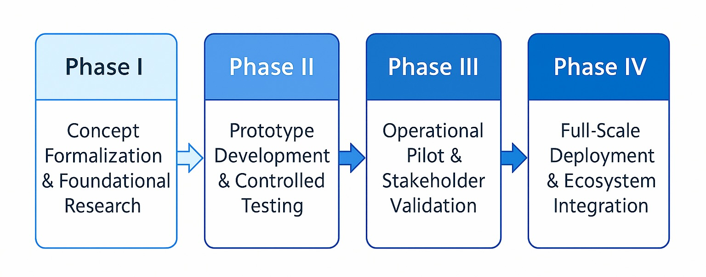

# Cognitive Oversight Framework  
**A Paradigm Shift in Monitoring and Observability**  
**Vision and Scope for Industry Adoption**  
**Draft White Paper – Internal Review Copy**  
**Quantirax Lab**  
**September 2025**

---

## Table of Contents

- [Executive Summary – Cognitive Oversight Framework](#executive-summary--cognitive-oversight-framework)
- [Introduction](#introduction)
- [Problem Space](#problem-space)
- [Vision & Framework Overview](#vision--framework-overview)
- [Cognitive Blueprint](#cognitive-blueprint)
- [Architectural Composition](#architectural-composition)
- [Signal Odyssey](#signal-odyssey)
- [Value Narrative](#value-narrative)
- [Implementation Roadmap](#implementation-roadmap)
- [Operational Canvas](#operational-canvas)
- [The Oversight Shift: Rethinking System Awareness](#the-oversight-shift-rethinking-system-awareness)
- [Closing Summary](#closing-summary)
- [Appendix A — Background Reading](#appendix-a---background-reading)
- [Appendix B — Supplementary Figures](#appendix-b---supplementary-figures)

---

## Executive Summary – Cognitive Oversight Framework

Modern enterprises operate in dense, interdependent ecosystems where small disturbances propagate rapidly across services, teams, and domains. Traditional monitoring and observability platforms were never designed for this reality. They over-collect, under-interpret, and react late — producing motion without meaning. Fragmented tooling, numerical myopia, and the absence of operational memory leave operators triaging floods of alerts while real risks slip through as weak cross-signals.  
The Cognitive Oversight Framework replaces volume-first inspection with purpose-first oversight. It centers on a deploy-time intent baseline compiled from SLAs and policies, ensuring that runtime decisions evaluate behavior against what must remain true, not merely what changed. At the edge, On-Edge Semantic Telemetric Agents (O-ESTA) perform semantic filtration and context binding. The Concord Reservoir then provides the structured memory plane and integration hub, preserving context and supplying the Oversight Engine for neutral, clause-referenced reasoning. The Temporal Spillway sequences and stitches behavior over time, infusing adjudications into coherent timelines for retrieval and audit. A Cognitive Gate exposes these insights through a governed access surface, and the Observatory Deck presents them as role-aligned, dashboard-style views without compromising neutrality.  
The proposed architecture draws heavy inspiration from water resource engineering: streams are filtered and converged at the source (O-ESTA), stored as a stable body of contextual memory (Concord Reservoir), reasoned upon to extract actionable energy (Oversight Engine), and released via regulated spillways that form canals (Temporal Spillway) — delivered through a governed outlet (Cognitive Gate) to the Observatory Deck, and ultimately converging into a broader semantic ocean of long-horizon memory. This correlation guides system behavior toward readiness, resilience, and explainability.

**Outcomes**  
- **Noise collapse:** Intent-aware edge semantics reduce incoherent alert floods while preserving what matters.  
- **Evidence-Driven Judgment:** Stitched timelines place full causal context on the table, enabling well-informed decision-making without rounds of back-and-forth investigation.  
- **Explainability & audit:** Each decision cites the exact intent clause and evidence chain.  
- **Cost governance:** Telemetry is admitted because it is useful, not “just in case.”  
- **Cross-domain & cross-technology oversight:** Signals across domains are unified into a single oversight fabric, and the design remains technology-agnostic.

---

## Introduction

The promise of monitoring has always been simple: if you can see what is happening, you can control it. From the earliest server logs to modern observability stacks, the goal has been to make systems transparent enough to diagnose and fix before they fail. Over the years, the industry has added more data, more dashboards, and more automation—yet the gap between what is measured and what is understood has grown wider.

As architectures shift from monoliths to cloud-native, distributed, and ephemeral systems, the fabric of operational awareness thins. Services are deployed and retired in minutes; dependencies span providers, regions, and edge devices; automation changes state faster than operators can track it. Failures rarely present as localized faults; they emerge as faint, scattered signals that cross technical and organizational boundaries.

The common response has been to gather more—metrics, logs, traces, and algorithmic alerts. But visibility without cohesion can be as dangerous as blindness. Teams drown in data but starve for meaning, spending more time chasing noise than isolating causes. Under pressure, tools meant to create clarity can accelerate confusion, especially when problems evolve faster than rules or correlations can adapt.

These shortcomings persist because the paradigm was not designed for the speed, scale, and interdependence of today’s infrastructure. Built on assumptions from an earlier era, monitoring and observability remain trapped in fragmented views, overreliance on numeric proxies, short-lived memory, and reactive responses. Closing this gap requires a shift from passive observation to cognitive oversight—a purpose-first, memory-conscious, and explainable model capable of understanding behavior in context, retaining it over time, and detecting meaning across domains before failure takes hold. This paper sets out that model as the Cognitive Oversight Framework.

---

## Problem Space

The shortcomings of today’s monitoring and observability systems are not a matter of missing features or incomplete dashboards. They are structural and philosophical flaws, rooted in assumptions that no longer hold true for the speed, scale, and volatility of modern infrastructure. These flaws are not isolated; they compound one another, eroding resilience and slowing decision-making when it matters most. At the core of the incumbent paradigm lie six interlinked failures — each reinforcing the others — that define why current approaches struggle to meet the demands of contemporary operations.

These failures can be grouped at two levels. At the framework level, the discipline is misframed, as captured by **Oversight Paradox** and **Observatory Evolution**. At the architectural level, design and implementation choices entrench the problem, as seen in **Edgebound Specter**, **Epicenter of Failure**, **Cognitive Void**, and **Temporal Amnesia**.

**Oversight Paradox:** Monitoring was meant to deliver control through visibility. Instead, it has produced fragmented snapshots that fail to form a coherent operational picture. Enterprises measure more than ever, yet understand less. Vast collections of raw data arrive stripped of meaning, offering metrics without context, numbers without narrative. The paradox is clear: more instrumentation has not led to more insight — it has created the illusion of oversight while leaving the reality of system behavior obscured.

**Observatory Evolution:** Observability emerged as a fix for the collapse of traditional monitoring, bringing richer telemetry through metrics, logs, and traces. But with greater data volume came greater complexity, and with complexity came new forms of misinterpretation. Blind spots gave way to blinding noise. The promise of deeper insight has been undercut by a deluge of signals that demand more interpretation than existing tools or teams can provide.

**Edgebound Specter:** At the infrastructure’s edge, agents act as tireless gatherers of telemetry — but not as interpreters. They lack semantic awareness, have no grasp of operational purpose, and remember nothing beyond fleeting samples. Operating as isolated collectors, they pass everything along indiscriminately. This unchecked flood saturates pipelines, overwhelms downstream analytics, and obscures the patterns that truly matter.

**Epicenter of Failure:** At the core of most observability stacks, decision-making remains bound to static thresholds, fixed rules, and reactive triggers. Such rigidity cannot match the dynamics of live systems. Alerts arrive too late, too often for false positives, and almost never in time to catch the faint, early indicators of real danger. The system responds only to what has already breached — not to what is about to fail.

**Cognitive Void:** No incumbent platform is built to think. Event processing is mechanical, stripped of semantic reasoning or the capacity to align telemetry with the system’s operational intent. While this reflects a broader paradigm gap, in practice it is experienced as an architectural absence: there is no neutral reasoning component to align behavior with declared purpose. Decisions are left to human operators who must mentally reconstruct the meaning from scattered traces.

**Temporal Amnesia:** Memorylessness is a design choice in most modern platforms. Context is discarded as soon as events are processed, with only coarse summaries retained. Without a persistent operational memory, the infrastructure cannot stitch together long-running patterns, detect gradual drifts, or recall the past in a way that illuminates the present. The result is a system that lives only in the moment — and forgets as fast as it sees.

Together, these flaws create a dangerous inability to detect, understand, and preempt complex failures before they escalate. Disjointed telemetry streams and the absence of unified reasoning leave organizations exposed to cascading effects — where small anomalies propagate silently until they culminate in critical disruption. Closing this gap demands an architecture that unifies telemetry, applies semantic reasoning, preserves operational memory, and delivers oversight as a continuous, adaptive capability.

---

## Vision & Framework Overview

Modern IT environments span many domains and operate at speeds where performance, security, and resilience must be managed continuously. The Cognitive Oversight Framework positions oversight as a proactive, context-aware discipline that aligns operational monitoring with the declared purpose and behavioral expectations of each component. It is cross-domain and cross-technology by design: the framework does not privilege any language, platform, or vendor, and it treats heterogeneous systems as parts of one operational narrative.

At the center of this vision are three guiding principles. **Intent as baseline:** oversight begins with an explicit statement of what must remain true, what may vary, and what is out of bounds. **Memory as a first-class asset:** context is retained and organized so behavior can be understood over time rather than reconstructed under pressure. **Explainable judgment:** decisions are rendered with evidence and rationale — clear, clause-referenced explanations that show why a condition matters, not only what changed. Together, these principles shift oversight from volume and thresholds to evidence-driven judgment.

In operation, the framework follows a deliberate oversight path without prescribing technologies. Signals are captured with their meaning, consolidated into shared operational memory, evaluated against declared intent by neutral reasoning, sequenced into coherent timelines, and then delivered through a governed interface for people and automated workflows. The proposed architecture draws heavy inspiration from water resource engineering: flows are filtered, context is held in reserve, release is regulated, and channels converge into a broader body of long-horizon memory — so when intervention is needed, the full picture is already at hand.

This is an architectural paradigm, not a tool or dashboard. It embeds alongside existing practices and complements incumbent monitoring by supplying the missing oversight layer. The intent is to provide a single, consistent basis for well-informed action — reducing noise, improving clarity, and ensuring that operational choices are grounded in purpose, context, and explanation.

---

## Cognitive Blueprint

The Cognitive Oversight Framework treats oversight as a continuous, adaptive discipline rather than a linear pipeline. Its capabilities operate in parallel and exchange context in real time, so meaning is preserved from capture to decision without forcing operators to reconstruct it under pressure. The blueprint is organized around three cooperating domains.

**Edge-level intelligence:** On-Edge Semantic Telemetric Agents capture signals with their meaning intact. They bind events to service identity, role, phase, and dependency context; compare what they see to the declared intent baseline; compress routine compliance; and elevate deviations with the evidence downstream reasoning will require. The aim is selective collection guided by purpose, not volume for its own sake.

**Core reasoning and temporal context:** Structured operational memory (the Concord Reservoir) holds the contextualized record that reasoning depends on. The Oversight Engine evaluates behavior against the intent baseline and emits evidence-driven, clause-referenced judgments. The Temporal Spillway sequences behavior over time, stitching adjudications into coherent timelines so history informs the moment of choice and remains available for audit, retrieval, similarity matching, and long-horizon correlation.

**Governance and oversight interface:** A Cognitive Gate governs how conclusions and timelines are exposed to people and automated workflows, enforcing neutrality, scope, and a clear trust boundary. The Observatory Deck renders the same reasoned state in role-aligned, dashboard-style views for operations, security, governance, and leadership — without fragmenting truth across competing dashboards. A feedback conduit closes the loop by channeling operational responses and environmental changes back into the blueprint, recalibrating semantics, baselines, and retention policies as conditions evolve.

**Design properties**  
- **Technology-agnostic and cross-domain**  
- **Modular, but mutually reinforcing**  
- **Explainable by construction**  
- **Memory as policy**  
- **Selective by intent**  
- **Federated composition**

*Figure 1: End-to-end architectural blueprint of the Cognitive Oversight Framework—from On-Edge Semantic Telemetric Agents (edge semantics and context binding), through the Concord Reservoir (structured operational memory) and the Oversight Engine (evidence-driven reasoning), to the Temporal Spillway (stitched timelines), the Cognitive Gate (governed exposure), and the Observatory Deck (role-aligned presentation) ..*

---

## Architectural Composition

Every layer of the Cognitive Oversight Framework is purpose-built to counter a specific weakness of the incumbent paradigm. The composition mirrors engineered water systems — collection, filtration, convergence, storage, and regulated release — so signals carry meaning from origin to use without losing context or continuity. What follows describes how each element contributes to a single, coherent oversight fabric.

**On-Edge Semantic Telemetric Agents:** First point of contact, operating close to signal sources. These agents bind events to identity, role, phase, and dependencies; compare observations to the declared intent baseline; compress routine compliance; and forward only context-rich deviations and summaries. By filtering at the source, they prevent downstream overload, preserve semantic fidelity, and ensure that reasoning begins with purposeful inputs rather than raw volume.

**Concord Reservoir:** The integration hub and memory plane that receives refined signals from the edge and preserves their context as structured operational memory. It retains stitched behavior, adjudications, and provenance so historical and emerging patterns remain equally accessible for retrieval, replay, audit, and long-horizon correlation. The Concord Reservoir keeps the organization’s operational narrative intact, eliminating the need to reconstruct context during incidents.

**Oversight Engine:** A neutral judgment layer that evaluates behavior against the intent baseline using the Concord Reservoir’s structured memory and, when needed, in-flight semantic streams. It detects drift, precursors of failure, and risk that matter operationally, and emits evidence-driven, clause-referenced conclusions. These adjudications are written back into the Reservoir, enriching the historical record with explainable decisions.

**Temporal Spillway:** The channel that organizes telemetry and conclusions into time-aligned streams, turning events into coherent behavioral narratives. It preserves continuity for audit and learning, supports similarity matching and trend synthesis, and ensures that history informs the moment of choice without forcing teams to reassemble fragments under pressure.

**Cognitive Gate:** The controlled outlet through which conclusions and timelines are delivered to people and automated workflows. It maintains neutrality and scope, enforces trust boundaries, and ensures that oversight outputs are consumed in alignment with operational and governance intent — so decisions travel with their rationale, not in isolation.

**Observatory Deck:** A governance surface that presents the same reasoned state as role-aligned, dashboard-style views for operations, security, governance, and leadership. It consolidates insight without fragmenting truth across competing dashboards, giving each audience the perspective it needs while drawing from one consistent source of meaning.

Taken together, these layers are modular yet mutually reinforcing. Signals are captured with intent at the edge, contextualized and remembered in the Reservoir, judged neutrally by the Engine, sequenced into timelines by the Spillway, governed at the Gate, and presented coherently on the Observatory Deck. In practice, operational actions and environmental changes flow back through the same fabric — recalibrating edge semantics, refining the intent baseline, and adjusting retention — so oversight remains aligned with evolving realities without introducing a separate, physical component.

---

## Signal Odyssey

Every oversight decision begins as a journey — one taken by the countless signals that pulse through the operational environment. The Signal Odyssey charts this journey from the instant a signal is born at the edge to the moment it becomes oversight-ready intelligence. It is not a linear conveyor belt of data; it is an evolving, semantic pilgrimage where each stage enriches meaning, strengthens fidelity, and sharpens purpose.

**Edge genesis:** The odyssey begins at the On-Edge Semantic Telemetric Agents (O-ESTA) where raw events are captured in real time from diverse telemetry sources — application logs, service metrics, API traces, security feeds, and infrastructure monitors. These agents are not passive collectors; they act as cognitive sentinels at the network perimeter, preprocessing data for semantic value rather than indiscriminately hoarding it. At this earliest stage, the architecture already applies intelligence — deciding not merely what to collect but why it matters, using intent-aligned operational context.

**Context binding:** Captured signals are meaningless without the operational narratives that give them life. O-ESTA agents attach semantic context — service identifiers, location markers, dependency maps, and workload roles — anchoring each signal in where it belongs within the operational model. This ensures that downstream reasoning engines do not have to reconstruct the world from disconnected fragments. A signal leaves this stage already aware of its place in the broader system.

**Intent alignment:** Once anchored, the signal’s relevance is measured against why it matters — evaluated against intent-aligned operational baselines derived from live Service Level Agreements (SLAs), organizational policies, and runtime priorities. At this stage, aggregation of routine signals becomes a critical noise-reduction technique: thousands of signals reporting normal, SLA-compliant states are compressed into summary packets, eliminating redundant chatter without losing operational awareness. This is not brittle rule enforcement; it is adaptive filtration that evolves as intent shifts.

**Reservoir convergence:** The surviving, relevance-qualified signals flow into the Concord Reservoir, the framework’s harmonization layer. Here, disparate telemetry is semantically normalized into a unified schema, removing duplication, aligning timestamps, and reconciling entity relationships. Like a stabilizing body of water, the Reservoir holds, structures, and balances incoming streams before they move into reasoning and temporal sequencing.

**Cognitive distillation:** Before touching temporal integration, signals pass through the Oversight Engine, which converts semantically structured telemetry into meaningful state representations. This stage applies layered reasoning, correlating signals across services, evaluating behavioral context, and deriving actionable insights. The Oversight Engine transforms the Reservoir’s harmonized data into high-value intelligence streams, ready for time-based sequencing.

**Temporal integration:** Signals deemed cognitively complete enter the Temporal Spillway, where they are sequenced, stitched, and embedded into historical timelines. As part of this process, they are persisted to support retrieval, audit, long-horizon correlation, and similarity matching. This temporal integration preserves behavioral patterns, causality chains, and operational rhythms, enabling the system to detect drift, anomalies, and latent threats with far greater precision.

**Oversight readiness:** The final stage ensures that signals are fully primed for governance and decision-making. By the time they reach this point, they are no longer “raw data” — they are distilled operational intelligence, ready to engage through the Cognitive Gate and be rendered on the Observatory Deck. This journey is not conceptual theory; it is operational reality within the framework — a reality absent in the incumbent paradigm, where signals often arrive at decision points stripped of context, history, and semantic meaning.

*Figure 2 — Signal Lifecycle within the Cognitive Oversight Framework, from Edge Genesis to Oversight Readiness

---

## Value Narrative

Enterprises operate as interdependent systems; a minor disturbance in one area can set off failures elsewhere. Yet most organizations still observe each domain in isolation. Security, network, application, and infrastructure telemetry are reviewed in separate tools and on separate timelines, so early, weak signals rarely align into a coherent picture until a visible symptom forces attention.

The Cognitive Oversight Framework addresses this by treating signals as evidence in a single, intent-aligned oversight layer. Instead of accumulating alerts, it assembles context: what changed, who and what were involved, how that behavior relates to declared purpose, and where it fits in the broader operational narrative. Because context and history travel with the signal, teams are not forced into rounds of reconstruction before they can choose a course of action.

In practical terms, day-to-day work changes. Operators and security teams see one narrative rather than many dashboards; they respond to a small number of well-framed conclusions instead of triaging floods of notices. Governance stakeholders view the same underlying state through perspectives aligned to their responsibilities, tying operational behavior back to service-level and policy commitments without re-interpretation. The framework spans domains and technology stacks without bias, so differences in language, platform, or vendor do not fracture judgment.

Over time, retained operational memory becomes a compound asset. Patterns that once required post-incident forensics are visible as part of normal operations; slow drift is recognized before it becomes risk; “what-if” questions can be explored with real history rather than anecdotes. The effect is cumulative: fewer interpretive detours between signal and decision, clearer accountability for why actions were taken, and a tighter link between operational reliability and organizational objectives.

In short, the Cognitive Oversight Framework replaces fragmented observation with a coherent basis for action—prioritizing meaning over volume, context over guesswork, and explanation over after-the-fact reconstruction.

---

## Implementation Roadmap

The development and deployment of the Cognitive Oversight Framework will progress through structured, well-defined stages, ensuring technical maturity, stakeholder confidence, and operational readiness. Each phase is designed to deliver tangible outcomes, de-risk subsequent stages, and validate the framework’s capacity to deliver transformative oversight across diverse infrastructures.

**Phase I – Concept Formalization and Foundational Research:** The initial stage focuses on translating the conceptual model into formal specifications and verifiable architectures. This includes developing a high-fidelity design blueprint, producing detailed technical documentation, and defining the core modules: On-Edge Semantic Telemetric Agents (O-ESTA), the Concord Reservoir, the Oversight Engine, the Temporal Spillway, and the Observatory Deck. A proof-of-concept will be constructed to demonstrate key capabilities such as intent-driven semantic filtration, contextual enrichment, and the lifecycle handling of telemetry—from ingestion at the edge through O-ESTA agents to contextual reasoning and conclusion storage in the Concord Reservoir.

**Phase II – Prototype Development and Controlled Testing:** The second stage advances from proof-of-concept to a fully functional prototype, integrating all modules into a cohesive framework. Controlled test environments will simulate real-world operational diversity, demonstrating resilience in handling multi-domain telemetry, executing layered reasoning in the Oversight Engine, and mitigating noise at scale. This stage will validate interoperability across monitoring, security, and governance contexts, ensuring that reasoning processes deliver precise, context-aligned insights in near real time.

**Phase III – Operational Pilot and Stakeholder Validation:** With the prototype proven, the framework will enter pilot deployments in live—but limited—operational environments. These will involve selected industry and public-sector partners, enabling evaluation under real workloads and governance scenarios. Feedback loops will refine the Concord Reservoir’s schema, calibrate semantic filtration thresholds in O-ESTA agents, and validate that the Observatory Deck delivers accurate, role-specific situational awareness for operators, security teams, governance officers, and executives.

**Phase IV – Full-Scale Deployment and Ecosystem Integration:** The final stage scales the framework for enterprise-wide and cross-infrastructure oversight. Advanced integrations will be implemented with existing monitoring, security, and governance systems, enabling replacement of fragmented legacy platforms without service disruption. Rollout will be accompanied by structured training programs, operational playbooks, and long-term support models to ensure adoption success and sustained performance.

This roadmap ensures that each phase produces a fully usable deliverable while laying the groundwork for the next. It balances ambition with pragmatism, allowing the framework to prove its value in successive layers of complexity before achieving full operational scope.

Figure 3: Implementation roadmap depicting the phased progression from ideation to deployment.

---

## Operational Canvas

The Cognitive Oversight Framework is engineered to operate across the full spectrum of modern infrastructure — from enterprise backends to critical public systems. Its modular, intent-driven design allows it to adapt seamlessly to diverse monitoring contexts without re-engineering the core. The following domains illustrate its operational reach:

**Enterprise Application Ecosystems:** Large-scale applications are rarely self-contained. They span microservices, APIs, legacy workloads, and cloud-native components. The framework’s semantic filtration ensures that only context-rich, operationally significant signals reach analysis, enabling early detection of dependency-driven incidents before they spread across the stack.

**Cybersecurity Posture Oversight:** Security operations often face overwhelming, uncorrelated alerts from EDR, SIEM, and network monitoring tools. The framework unifies these into a single semantic context, surfacing patterns that may otherwise go unnoticed — from subtle, distributed anomalies to coordinated multi-vector threats.

**Cloud and Hybrid Infrastructure Governance:** In hybrid and multi-cloud environments, operational blind spots emerge from complexity and inconsistent telemetry. By consolidating and reasoning over signals from on-premises systems, public cloud workloads, and interconnect fabrics, the framework enables proactive governance, catching misconfigurations, performance drift, or policy violations before they impact services.

**Critical Infrastructure and Public Services:** For utilities, transportation, or healthcare networks, even brief downtime can have public safety implications. The framework’s ability to reconcile telemetry from heterogeneous systems enables predictive interventions — ensuring continuity even when early warning signs originate in obscure or cross-domain sources.

**Network Operations and Capacity Planning:** Network health is shaped by more than bandwidth. Latency spikes, unusual routing patterns, or policy deviations can signal emerging issues. By linking live network telemetry with infrastructure and application health, the framework enables proactive scaling and routing decisions before performance degrades.

**AI-driven Operational Intelligence:** AI workloads depend as much on infrastructure stability as they do on data quality. The framework reasons over telemetry from ML pipelines, model-serving endpoints, and data ingestion layers, ensuring that AI-driven services meet performance, reliability, and compliance targets in production.

These domains represent only a fraction of the framework’s operational horizon. Any environment generating telemetry — whether from hardware, software, networks, or human interaction — can be brought under its semantic oversight. Because the framework’s adaptability resides in its intent-driven semantic layer, extending it to new domains involves defining how the framework should interpret, contextualize, and prioritize signals specific to that environment. This may include mapping new telemetry types to operational concepts, adjusting relevance thresholds, and refining correlation logic. Such changes do not require re-engineering the core system, allowing the framework to evolve into a broader operational intelligence fabric that scales seamlessly with the complexity and ambitions of the organizations it serves.

---

## The Oversight Shift: Rethinking System Awareness

Modern observability platforms have long promised comprehensive insight into complex systems, yet their approach often remains tethered to fragmented signals, rigid logic, and context-blind metrics. The Cognitive Oversight Framework represents a decisive shift — one that moves from passive data aggregation to active, intent-aligned reasoning. This shift is not about replacing dashboards with different dashboards; it is about replacing a reactive mindset with a proactive, contextually intelligent oversight fabric. At its core, the Oversight Shift redefines the role of monitoring from “looking at what happened” to “understanding what is happening and why.”

**Dimension-by-Dimension Contrast**

| Dimension | Incumbent Paradigm | Cognitive Oversight Framework Approach |
|---|---|---|
| **Core Purpose** | Collect and visualize metrics, logs, and traces for operators to interpret. | Transform raw telemetry into semantically reasoned insights aligned with declared system intent. |
| **Data Handling** | Ingest everything; minimal semantic filtering; high storage and processing overhead. | O-ESTA filter and route only contextually relevant signals. |
| **Reasoning Ability** | Manual interpretation or static rules; limited anomaly ML. | Oversight Engine reasons over live + historical context, preserving continuity. |
| **Memory & Context** | Largely stateless; passive storage without semantic linkage. | Concord Reservoir + Temporal Spillway preserve stitched timelines for decisions. |
| **Decision Interface** | Dashboards and alerts — operators must decide and act. | Cognitive Gate exposes structured, neutral insights to workflows and humans. |
| **Scalability** | Scaling increases noise and fatigue. | Semantic filtration & reasoning reduce noise; scale without overload. |
| **Adaptability** | Manual reconfiguration for new services/telemetry. | Intent-driven configs adjust filtering and reasoning dynamically. |
| **Outcome Focus** | Reactive; detects after symptoms appear. | Anticipatory; contextualizes and prevents before impact. |

This shift in paradigm is not merely a technological evolution — it is an operational reorientation. By embedding reasoning, memory, and context directly into the oversight fabric, the Cognitive Oversight Framework turns observability from an interpretive task into an intelligent, collaborative process between systems and operators. Instead of relying on human teams to spot cross-domain anomalies buried in data noise, the framework continuously interprets and correlates events in the background, surfacing only those that matter — already framed in context and ready for action.

---

## Closing Summary

The Cognitive Oversight Framework consolidates today’s fragmented monitoring into a single, purpose-first oversight fabric. Signals are captured with meaning at the source through On-Edge Semantic Telemetric Agents, preserved as structured operational memory in the Concord Reservoir, evaluated against declared intent by the Oversight Engine, sequenced into coherent timelines via the Temporal Spillway, delivered with governed exposure through the Cognitive Gate, and presented as role-aligned, dashboard-style views on the Observatory Deck. The result is not more data but more meaning: evidence-driven judgment that states why a condition matters, not merely what changed.

The proposed architecture draws heavy inspiration from water resource engineering: flows are filtered and converged at the source, stored as a stable body of contextual memory, reasoned upon to extract actionable energy, and released through regulated spillways—forming canals that ultimately converge into a broader ocean of long-horizon operational memory. This correlation preserves continuity, supports explanation, and ensures that when intervention is needed, the full picture is already at hand.

By remaining technology-agnostic and spanning domains without favor, the Cognitive Oversight Framework provides one narrative for operations, security, governance, and leadership—different perspectives, not different truths. Noise collapses through intent-guided selection; decisions arrive with their rationale; continuity over time turns slow drift and weak cross-signals into usable foresight. In short, oversight becomes a first-class function of digital infrastructure: proactive, explainable, and aligned with the promises the organization makes to its users.

---

## Appendix A - Background Reading

This white paper proposes the Cognitive Oversight Framework. For background context on distributed systems, SRE practice, and observability, the following works are recommended. They are provided for context rather than as citations for specific statements in the paper.

- Burns, Brendan. *Designing Distributed Systems: Patterns and Paradigms for Scalable, Reliable Services.* O’Reilly, 2018.  
  https://books.google.com/books?id=5hJNDwAAQBAJ  
- Beyer, Betsy; Jones, Chris; Petoff, Niall; Murphy, Jennifer (eds.). *Site Reliability Engineering: How Google Runs Production Systems.* O’Reilly, 2016 (online edition).  
  https://sre.google/sre-book/table-of-contents/  
- Majors, Charity; Fong-Jones, Liz; Miranda, George. *Observability Engineering: Achieving Production Excellence.* O’Reilly, 2022.  
  https://info.honeycomb.io/observability-engineering-oreilly-book-2022  
- CNCF TAG Observability. “Observability Whitepaper 1.0,” 2023.  
  https://github.com/cncf/tag-observability/blob/main/whitepaper.md

---

## Appendix B - Supplementary Figures

This white paper includes on-page PNG renderings of two figures for A4 layout consistency. The vector originals are provided in the accompanying `/figures` directory for detailed inspection or reuse. Filenames mirror the figure numbers in the document.

- **Figure 1 — Architectural blueprint of the Cognitive Oversight Framework.**  
  Vector source: `figures/figure-01-architectural-blueprint.svg`
- **Figure 2 — Signal Odyssey.**  
  Vector source: `figures/figure-02-signal-odyssey.svg`
- **Figure 3 — Implementation Roadmap.**  
  Vector source: `figures/ImplementationRoadmap.jpeg`

